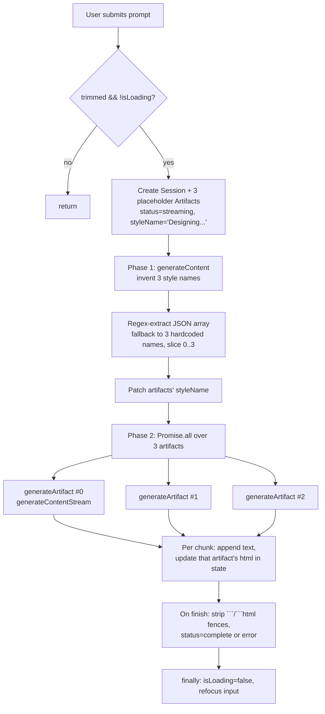
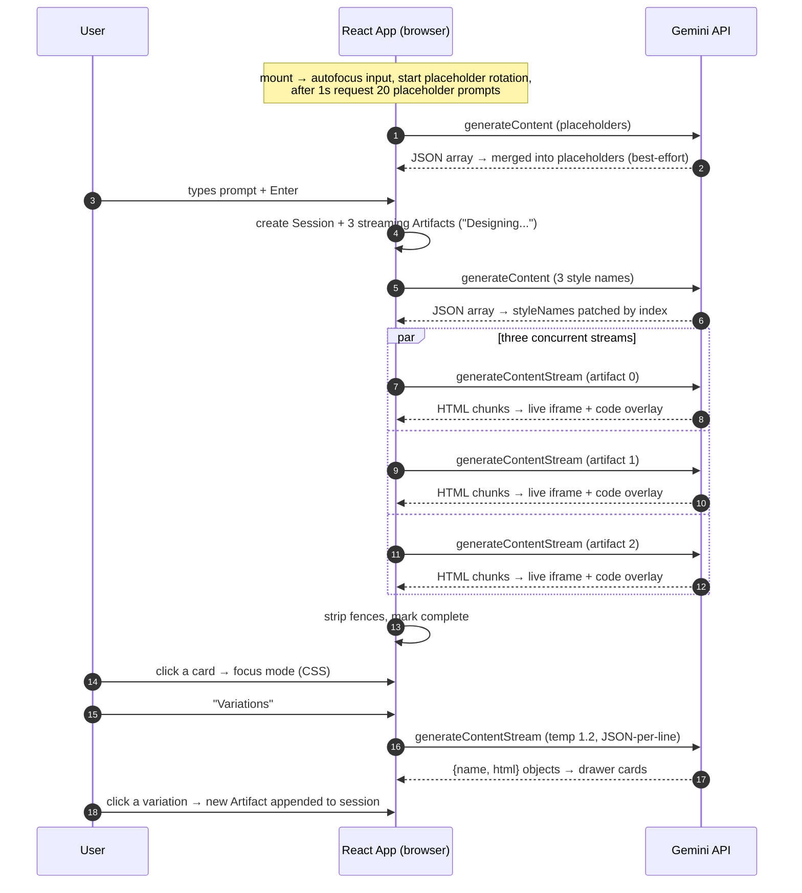

# UIHive — Project Description & Architectural Analysis

> A descriptive analysis of the *existing* project: what it is, how it works, which systems it uses, and how each subsystem is architected. It is written to support independent design decisions for a platform-agnostic reimplementation. It intentionally contains **no build steps and no roadmap**.

---

## 1. Identity & Provenance

| Attribute | Value | Source |
|---|---|---|
| Project name | `uihive` | `package.json` |
| Display name | **UIHive** | `metadata.json`, `<h1>` in `index.tsx` |
| HTML document title | `Diffusion Chat` (mismatch with display name) | `index.html` |
| Origin | AI Studio ("vibe coded") app, app id `53030aab-538b-4ba6-b3b6-b3b8eb2c7769` | `README.md`, `index.tsx:6` |
| Author attribution | `ammaar@google.com` (UI credit link to `x.com/ammaar`) | `index.tsx:6`, `index.tsx:450` |
| License | Apache-2.0 headers on every source file | all `.ts`/`.tsx` |
| AI Studio metadata | `requestFramePermissions: []`, `majorCapabilities: []`, empty `prompt` | `metadata.json` |

**Stated purpose** (`metadata.json`): *"Put Gemini 3 Flash's creativity and coding abilities to the test. Rapidly generate UI, explore variations, and export code."*

The product is a **prompt→UI generator**: the user types a natural-language UI request, the app fans out to three parallel model calls, and streams back three self-contained HTML/CSS/JS "artifact" previews rendered live in the browser.

---

## 2. High-Level Concept

The app is a **single-page, client-only, AI-in-the-loop design tool**. Its distinguishing behaviors:

1. **Multi-candidate fan-out** — one prompt produces *three* independent design directions, generated concurrently.
2. **Two-phase generation** — first a cheap non-streaming call invents three style/persona *names*, then three streaming calls each write full HTML under one of those directions.
3. **Progressive rendering** — partial HTML is rendered continuously into a sandboxed iframe while the model still streams.
4. **A 3D "deck" session model** — every prompt creates a *session*; sessions are navigated like a horizontal carousel with depth.
5. **On-demand variation expansion** — any focused artifact can spawn three more conceptual variations.
6. **No backend, no persistence** — all state is in-memory React state; the model API is called directly from the browser.

---

## 3. Technology Stack & Systems

### 3.1 Runtime & framework

| Layer | Choice | Notes |
|---|---|---|
| UI framework | **React 19** (`react`, `react-dom` `^19.0.0`) | Function components + hooks only |
| Language | **TypeScript ~5.8.2** | `target: ES2022`, `module: ESNext`, `jsx: react-jsx`, `noEmit` |
| Module resolution | `bundler` | `allowImportingTsExtensions`, `isolatedModules`, `moduleDetection: force` |
| Path alias | `@/*` → `./*` | Declared in both `tsconfig.json` and `vite.config.ts` |
| Bundler / dev server | **Vite ^6.2.0** | Dev server on port `3000`, host `0.0.0.0` |
| React plugin | `@vitejs/plugin-react` `^5.0.0` | Adds React Refresh in dev |
| AI SDK | **`@google/genai` ^0.7.0** | Gemini SDK |
| Node types | `@types/node` `^22.14.0` | Used for `path` in Vite config |
| Styling | **Hand-written single CSS file** (`index.css`, ~693 lines) | No Tailwind, no CSS-in-JS, no CSS modules |
| Icons | Inline hand-written SVG components | `components/Icons.tsx` |
| State management | **Local React state only** | No Redux/Zustand/Context/router |
| Tests / lint | **None present** | No test runner, no ESLint/Prettier config |
| Lockfiles | Both `bun.lock` **and** `package-lock.json` | Dual package-manager footprint |
| Scripts | `dev` / `build` / `preview` (Vite) | `package.json` |

### 3.2 Entry & boot

`index.html` → `<div id="root">` → `<script type="module" src="index.tsx">`.

`index.html` also declares an **import map** pointing to `esm.sh` for `@google/genai`, `react`, `react/`, `react-dom/`. This is a Web-standalone/AI-Studio artifact: in the Vite build the npm packages win, while the import map would serve a raw-browser path. Both mechanisms coexist.

`index.tsx` mounts with `ReactDOM.createRoot(...).render(<React.StrictMode><App /></React.StrictMode>)` (`index.tsx:592-595`).

> Observed redundancy: `index.html` loads `index.css` twice (lines 7 and 19) and `index.tsx` twice (lines 23 and 24). Harmless but indicative of export tooling.

---

## 4. Repository / Module Architecture

The project is intentionally flat — no `src/`, no feature folders.

```
UIHive/
├── index.html              # Shell: #root, import map, duplicate asset tags
├── index.tsx               # ENTIRE application logic + view (596 lines)
├── index.css               # ENTIRE styling + animation system (693 lines)
├── types.ts                # Domain types (4 interfaces)
├── constants.ts            # INITIAL_PLACEHOLDERS (7 strings)
├── utils.ts                # generateId()
├── metadata.json           # AI Studio app manifest
├── vite.config.ts          # Dev server, env injection, alias
├── tsconfig.json
├── package.json
├── components/
│   ├── ArtifactCard.tsx    # iframe renderer + streaming overlay
│   ├── SideDrawer.tsx      # Generic right-side panel
│   ├── DottedGlowBackground.tsx  # Canvas dot-glow animation
│   └── Icons.tsx           # 7 inline SVG icon components
├── README.md
└── node_modules/
```

### 4.1 Layer responsibilities

| Module | Responsibility | Coupling |
|---|---|---|
| `index.tsx` | **God component**: all state, all model calls, all streaming logic, layout composition | High — directly instantiates the Gemini SDK |
| `components/ArtifactCard.tsx` | Pure presentation of one artifact; owns its iframe and auto-scroll | Low — takes `artifact`, callbacks |
| `components/SideDrawer.tsx` | Generic overlay panel; agnostic to content | None |
| `components/DottedGlowBackground.tsx` | Self-contained canvas animation with its own lifecycle | None |
| `types.ts` | Domain vocabulary | None |
| `utils.ts` | ID generation | None |
| `constants.ts` | Seed placeholder prompts | None |

**Only `index.tsx` touches the AI provider.** Everything else is presentation. This is the natural seam for provider abstraction.

---

## 5. Domain Model

From `types.ts`:

```ts
interface Artifact {
  id: string;
  styleName: string;              // the design persona / direction name
  html: string;                   // raw generated HTML document (self-contained)
  status: 'streaming' | 'complete' | 'error';
}

interface Session {
  id: string;
  prompt: string;                 // the user's original request
  timestamp: number;              // Date.now() at creation
  artifacts: Artifact[];          // normally 3, grows via "variations"
}

interface ComponentVariation { name: string; html: string; }
interface LayoutOption { name: string; css: string; previewHtml: string; }
```

Notes:

- **`Session` is the unit of history.** One prompt = one session = one grid of up to 3+ artifacts.
- **`Artifact.status` is an explicit state machine**: `streaming` (chunks arriving) → `complete` (fenced-code stripped, non-empty) or `error` (exception, or empty result).
- **`LayoutOption` is defined but never used** — leftover/dead type, suggesting an abandoned feature.
- `generateId()` (`utils.ts`) = `Date.now().toString(36) + Math.random().toString(36).substring(2)`. Artifact placeholder IDs are `${sessionId}_${i}`.

---

## 6. Application State

All state lives in the single `App` component (`index.tsx:30-49`):

| State | Type | Purpose |
|---|---|---|
| `sessions` | `Session[]` | Full conversation history |
| `currentSessionIndex` | `number` | Active session; `-1` = empty start screen |
| `focusedArtifactIndex` | `number \| null` | `null` = grid mode; number = full-screen focus mode |
| `inputValue` | `string` | Prompt input |
| `isLoading` | `boolean` | Global generation flag (blocks send) |
| `placeholderIndex` | `number` | Current rotating placeholder |
| `placeholders` | `string[]` | Seed list + dynamically generated prompts |
| `drawerState` | `{ isOpen, mode: 'code'\|'variations'\|null, title, data }` | Side drawer |
| `componentVariations` | `ComponentVariation[]` | Streamed variations for the drawer |

Refs: `inputRef` (autofocus), `gridScrollRef` (mobile scroll reset).

The **two navigation axes are orthogonal**: `currentSessionIndex` scrolls the deck; `focusedArtifactIndex` zooms into one card. `focusedArtifactIndex !== null` is effectively a derived *mode* (focus vs. grid) that drives most of the CSS.

### 6.1 Effects

| Effect | Trigger | Behavior |
|---|---|---|
| Autofocus | mount | Focus the input |
| Mobile scroll reset | `focusedArtifactIndex` change, width ≤ 1024 | Zero out `gridScrollRef.scrollTop` + `window.scrollTo(0,0)` to defeat mobile fixed-position/overscroll drift |
| Placeholder rotation | `placeholders.length` | Advance index every 3000 ms |
| Dynamic placeholders | mount | After 1000 ms, call the model for 20 new prompts; best-effort (`console.warn` on failure) |

The dynamic-placeholder effect is "fire and forget": failures are deliberately swallowed, and the feature is optional to the core UX.

---

## 7. The AI System (Core)

### 7.1 Provider & transport

- **Provider:** Google Gemini, via the official `@google/genai` SDK.
- **Client construction:** a **new `GoogleGenAI` instance per call site**, not a shared singleton:
  ```ts
  const ai = new GoogleGenAI({ apiKey: process.env.API_KEY });
  ```
- **Key source:** `process.env.API_KEY`, which is a **build-time constant**, not a real env var (see §9).
- **Model:** every call hardcodes **`'gemini-3-flash-preview'`**.
- **No `baseUrl`/`httpOptions` override** is configured, so it targets Google's default endpoint.
- **No streaming cancellation** (`AbortController`/`signal`) anywhere; `isLoading` is the only concurrency guard.

### 7.2 The four call sites

| # | Location | Method | Streams? | Purpose | Output contract |
|---|---|---|---|---|---|
| 1 | `index.tsx:80` | `models.generateContent` | No | Generate 20 placeholder prompts | Raw JSON array of strings → regex-extracted |
| 2 | `index.tsx:282` | `models.generateContent` | No | Name 3 design directions | Raw JSON array of 3 strings → regex-extracted |
| 3 | `index.tsx:337` | `models.generateContentStream` | **Yes** | Write each artifact's HTML | Raw HTML text (fences stripped) |
| 4 | `index.tsx:181` | `models.generateContentStream` | **Yes** | 3 concept variations | One JSON object per line `{name, html}` |

Only call #4 passes a `config` (`temperature: 1.2`). Calls #1–#3 use provider defaults.

### 7.3 The two-phase main pipeline (`handleSendMessage`)



Key properties:

- **Placeholders exist before any model output.** The UI shows three "Designing…" cards immediately; each card streams into place.
- **Phase 1 is a separate, non-streaming call.** It returns an array of style names, patched onto artifacts by index. If parsing fails or fewer than 3 names return, a hardcoded fallback triple is used.
- **Phase 2 fans out with `Promise.all`.** Each `generateArtifact` has its **own try/catch**, so a failure in one produces an `error` artifact rather than rejecting the batch.
- **Incremental state updates:** every streamed chunk triggers a `setSessions` map that replaces only the matching artifact's `html`, so React re-renders that card live.
- **Fence-stripping** after completion removes leading ` ```html `/` ``` ` and a trailing ` ``` `.
- **The `useCallback` dependency array is `[inputValue, isLoading, sessions.length]`** — note `sessions.length`, not `sessions`.

### 7.4 The variation pipeline (`handleGenerateVariations`)

- Requires an active session **and** a focused artifact.
- Opens the drawer in `'variations'` mode *before* streaming, so the loading state is visible.
- Prompt asks for **3 "radical conceptual variations"** with an explicit **IP safeguard** (no artist/brand names; describe physicality/material logic instead).
- Uses `generateContentStream` with `temperature: 1.2` for diversity.
- Each parsed object is appended to `componentVariations` as it arrives.
- Clicking a variation (`applyVariation`) **creates a new `Artifact`** appended to the *current session*, focuses it, and closes the drawer.

### 7.5 Prompt design system

All four prompts share a consistent authorial voice and encode several deliberate constraints:

| Prompt concept | Where | Intent |
|---|---|---|
| **IP safeguard** | Calls 1, 2, 4, and the artifact prompt | Forbid artist/brand/movie names; steer toward material/physical metaphors |
| **Material-first vocabulary** | "Risograph grain", "kinetic wireframe", "spectral prismatic diffusion" | Force concrete CSS-drivable descriptors rather than imitation of a known style |
| **Strict output format** | "Return ONLY a raw JSON array", "Return ONLY RAW HTML. No markdown fences." | Make output machine-parseable without a schema |
| **Execution rules for HTML** | Artifact prompt §1–5 | Materiality → CSS technique, typography pairing, subtle motion, IP safety, bold layout |
| **JSON-per-line for streaming** | Variations prompt | Enables incremental parsing of a *streaming* array |

Notably, the prompts rely on the model obeying natural-language format instructions; there is **no use of Gemini structured output / response schema / function calling**, and **no JSON mode**.

### 7.6 Streaming JSON parser (`parseJsonStream`, `index.tsx:109-142`)

An async generator that turns a text stream of concatenated JSON objects into individually yielded objects:

1. Append each chunk's text to a buffer.
2. Find the first `{`, then scan forward with a **brace-depth counter** until depth returns to 0 → that span is a candidate object.
3. `JSON.parse` the span; on success yield it and trim the buffer; on parse failure, advance the search to the next `{`.

This is a **hand-rolled incremental JSON scanner**. It is transport-agnostic in concept (it only needs a stream of text), but fragile: it counts braces **without string/escape awareness**, so it only works because the embedded HTML/CSS in `html` happens to contain balanced braces. Any unbalanced brace inside a JSON string would break framing.

---

## 8. Rendering & UI Architecture

### 8.1 Artifact rendering & the sandbox

`ArtifactCard.tsx` renders each artifact inside:

```html
<iframe srcDoc={artifact.html}
        sandbox="allow-scripts allow-forms allow-modals allow-popups allow-presentation allow-same-origin" />
```

| Concern | Behavior |
|---|---|
| Isolation mechanism | `<iframe sandbox>` with **`srcDoc`** (inline document, no network fetch) |
| Script execution | `allow-scripts` — generated JS runs |
| Origin | `allow-same-origin` **combined with** `allow-scripts` — the framed doc is *not* isolated from the parent origin |
| Interaction | `pointer-events: none` by default; **only enabled in focus mode** (`.mode-focus .artifact-iframe`) |
| Streaming preview | While `status === 'streaming'`, a dark overlay shows the raw accumulating HTML in a green monospaced `<pre>` that auto-scrolls to the bottom |

> Security implication worth noting for a reimplementation: `allow-scripts` + `allow-same-origin` on **model-generated, untrusted** HTML means generated code can, in principle, reach into the parent origin. A cleaner design uses `allow-scripts` **without** `allow-same-origin` (opaque origin), or a worker/portal isolation strategy.

`ArtifactCard` is `React.memo`'d and only re-renders when its artifact object changes — important because streaming mutates one artifact at a time.

### 8.2 The "deck" layout system

The whole UI is an immersive, non-scrolling stage (`body { overflow: hidden }`, `#root` is a 100vh flex column).

- **`DottedGlowBackground`** — an absolutely positioned canvas (`z-index: 0`) behind everything.
- **`.stage-container`** — absolute inset, flex-centered, `perspective: 1500px`, toggles `mode-split` / `mode-focus`.
- **`.session-group`** — one absolute, full-size layer per session, positioned by class:

| Class | Transform | Meaning |
|---|---|---|
| `active-session` | `translateX(0) scale(1)`, z 10 | current |
| `past-session` | `translateX(-120%) translateZ(-300px)`, opacity 0, z 5 | previous |
| `future-session` | `translateX(+120%) translateZ(-300px)`, opacity 0, z 5 | upcoming |

This yields a **3D horizontal carousel**: past/future sessions sit off-screen and pushed "back" in Z, cross-fading on navigation. `transform-style: preserve-3d` on the group supports the depth effect.

- **`.artifact-grid`** — inside each session: CSS grid `repeat(auto-fit, minmax(320px, 1fr))`, capped at `max-height: 75vh`, internally scrollable. In split mode it's forced to **3 columns** (2 below 1200px, 1 below 1024px).

### 8.3 Focus mode

Focus is a **CSS state**, not a route. When `focusedArtifactIndex !== null` the stage gets `mode-focus`, and:

- All non-focused cards: `opacity: 0`, `pointer-events: none`, `scale(0.8)`.
- The focused card: `position: fixed; top/left 50%; width 90vw; max-width 1200px; height 85vh; translate(-50%,-50%); z-index 100` — literally breaks out of the grid.
- Its header is hidden for immersion; the iframe becomes interactive.
- **Critical defensive CSS**: `.mode-focus` forces `perspective: none` and `transform: none` on ancestors, explicitly to fix mobile fixed-positioning drift.

### 8.4 Interaction surfaces

| Surface | Element | Trigger | Behavior |
|---|---|---|---|
| Prompt input | `.floating-input-container` | Always | Pill-shaped, blurred/translucent, shimmer band while loading |
| Placeholder hint | `.animated-placeholder` | Empty input + not loading | Rotating prompt text + `Tab` hint badge |
| Keyboard | input `onKeyDown` | `Enter` | Submit |
| Keyboard | input `onKeyDown` | `Tab` (empty input) | Autofill current placeholder |
| Send | `.send-button` | Click | `handleSendMessage()` |
| Surprise Me | `.surprise-button` | Click (start screen) | Submit the current placeholder immediately |
| Nav handles | `.nav-handle.left/.right` | Hover stage | Prev/next — artifact within a session if focused, else session |
| Action bar | `.action-bar` | Appears when focused | Grid View / Variations / Source |
| Creator credit | `.creator-credit` | Always | External link; hidden on mobile once generation starts |

**Navigation semantics** (`prevItem`/`nextItem`): if an artifact is focused, arrows move **artifact index**; otherwise they move **session index**. `canGoBack`/`canGoForward` are derived from those bounds.

### 8.5 The drawer

`SideDrawer` is generic: an overlay that closes on backdrop click, with a right-anchored panel (`max-width: 420px`, heavy backdrop blur, slide-in animation). Two content modes:

- **`code`** — `<pre class="code-block">` showing `artifact.html` verbatim.
- **`variations`** — `.sexy-grid` of `.sexy-card`s. Each preview is an **iframe scaled down via `width/height: 400%` + `transform: scale(0.25)`** (mobile: fixed `1000×640` at `scale(0.16)`), `pointer-events: none`. Clicking a card applies that variation.

### 8.6 The background canvas (`DottedGlowBackground.tsx`)

A self-contained procedural animation, decoupled from app state:

- Builds a **dot grid** (`gap`, `radius`) with each row offset by half a gap (hex-like packing).
- Each dot has a random `phase` and `speed` (`speedMin`…`speedMax`).
- Per frame, intensity is a **triangle wave** of `(time·speed + phase) mod 2`; above 0.7 the dot switches to `glowColor` and gains `shadowBlur`, below it uses the dim `color`.
- Handles **devicePixelRatio** scaling, uses a **`ResizeObserver`** for sizing and a `window` resize listener, runs on `requestAnimationFrame`, and fully cleans up on unmount.
- Easing is quadratic (`lin * lin`) for a pulse feel.
- Instantiated with `gap=24, radius=1.5, color=rgba(255,255,255,0.02), glowColor=rgba(255,255,255,0.15), speedScale=0.5`.

### 8.7 Styling system characteristics

- **CSS custom properties** in `:root` define a dark palette (`--app-bg #09090b`, `--stage-bg #18181b`, `--accent-color #fff`, etc.) and `--font-sans` (Inter).
- Fonts: **Inter** (sans) and **Roboto Mono** (code/stream) loaded from Google Fonts, both via `@import` in `index.css` *and* a `<link>` in `index.html`.
- Motion vocabulary: `dramaticEntrance` (blur+translate+scale), `placeholderSlideUp`, `shimmerMove`, `pulseText`, `ambientFadeIn`, `slideInRight`, `spin`.
- Heavy use of `backdrop-filter: blur(...)` for the glass aesthetic.
- Responsive breakpoints at **1200px** (3→2 columns) and **1024px** (full mobile mode: grid becomes a flex column, focus card resized/repositioned, creator credit hidden).

---

## 9. Configuration, Environment & Secrets

The key mechanism (the only "backend-ish" part of the app):

```ts
// vite.config.ts
const env = loadEnv(mode, '.', '');
define: {
  'process.env.API_KEY':         JSON.stringify(env.GEMINI_API_KEY),
  'process.env.GEMINI_API_KEY':  JSON.stringify(env.GEMINI_API_KEY),
}
```

Implications:

- `process.env.API_KEY` in `index.tsx` is **not read at runtime** — Vite performs a **static string substitution** during build/dev, inlining the literal key into the bundle.
- The key originates from a `.env` / `.env.local` file (`GEMINI_API_KEY`), read by `loadEnv`.
- The app guards with `if (!apiKey) throw new Error("API_KEY is not configured.")` at each call site.
- **The key is therefore shipped to the client and visible in the built JS / network calls.** This is a development/experiment posture, not a production one. A public/secure design would move model calls behind a server proxy.
- Alias `@` → project root is configured in Vite; `tsconfig.json` mirrors it via `paths`.

---

## 10. End-to-End Runtime Walkthrough



**Modes summary:**

| Mode | Determined by | Visual |
|---|---|---|
| Empty / start | `sessions.length === 0` | Animated title + "Surprise Me" |
| Grid (split) | `focusedArtifactIndex === null` | 3-column (or responsive) grid of cards |
| Focus | `focusedArtifactIndex !== null` | One card full-screen, others hidden |
| Drawer: code | `drawerState.mode === 'code'` | `<pre>` source |
| Drawer: variations | `drawerState.mode === 'variations'` | Scaled iframe previews, or spinner |

---

## 11. Platform-Agnostic Decomposition

This section reframes the app as **invariants (what any faithful reimplementation must preserve)** vs. **implementation choices (what is swappable)**, so the design can be rebuilt on another platform without copying this stack.

### 11.1 Invariants — the product's actual behavior

1. **Session-per-prompt history** with an ordered list of artifacts.
2. **Fan-out of N (here 3) concurrent candidates** per prompt.
3. **Two-phase generation**: cheap text plan → per-candidate rich generation.
4. **Incremental streaming into a live preview**, with raw-code feedback during generation.
5. **Artifact state machine**: `streaming → complete | error`.
6. **Sandboxed execution of untrusted generated HTML/JS/CSS.**
7. **On-demand expansion** of a focused artifact into alternative candidates.
8. **Deck-style navigation** across sessions plus a focus/zoom state per artifact.
9. **Ephemeral session state** (nothing is persisted).

### 11.2 Swappable implementation choices

| Subsystem | This project uses | Platform-agnostic equivalent to consider |
|---|---|---|
| UI runtime | React 19 function components + hooks | Any component model; the concepts are just observable state + derived mode |
| State | Single god-component `useState` | Any store; the real model is `sessions[]`, `activeSession`, `focusedArtifact`, `generating` |
| LLM transport | `@google/genai` SDK | Any streaming completion transport normalized to a text-chunk stream |
| Streaming shape | Gemini `chunk.text` on an `AsyncGenerator` | OpenAI-style SSE `choices[].delta.content`; normalize at an adapter boundary |
| Structured output | Prompt-enforced JSON + regex/brace parsing | Native JSON mode / response schema / function calling where available |
| Candidate fan-out | `Promise.all` of 3 stream calls | Any concurrency primitive; consider bounded concurrency + cancellation |
| Rendering untrusted UI | `<iframe srcDoc sandbox>` | Opaque-origin iframe, dedicated worker + canvas, or per-artifact origin |
| Styling/animation | Hand-written CSS + keyframes + CSS vars | Any styling system; the *effects* (deck 3D, glass, shimmer) are the spec |
| Background | Canvas 2D + rAF | Any render surface; only the dot-grid pulse algorithm matters |
| Config/secrets | Vite `define` inlining an env var | Server-side key + proxy, or platform secret store |
| Persistence | None | Local storage / DB / URL state, if desired |

### 11.3 Ports & adapters view

A clean reimplementation separates a provider-neutral core from adapters:

```
┌──────────────────────────────────────────────────────────┐
│  Domain core (provider- & platform-neutral)              │
│  • Session / Artifact model + status machine             │
│  • Generation orchestrator (plan → fan-out → stream)     │
│  • Incremental stream framing (JSON objects / raw text)  │
│  • Navigation & focus state machine                      │
└──────────────────────────────────────────────────────────┘
        ▲                ▲                 ▲
        │                │                 │
┌───────┴──────┐ ┌───────┴────────┐ ┌──────┴────────────┐
│ LLM provider │ │ Renderer /     │ │ Config & secrets  │
│ adapter      │ │ sandbox host   │ │ adapter           │
│ (text-chunk  │ │ (iframe/worker │ │ (client key vs.   │
│  stream)     │ │  /portal)      │ │  server proxy)    │
└──────────────┘ └────────────────┘ └───────────────────┘
```

The only file that must change to swap providers is `index.tsx` (all four call sites). Everything in `components/` and `types.ts` is already provider-agnostic.

### 11.4 Decision points to resolve when rebuilding

| Question | This project's answer | Trade-off to weigh |
|---|---|---|
| Where does the API key live? | Inlined in the client bundle | Convenience vs. key exposure; a proxy adds a server but protects the key and lets you normalize providers |
| Is output structured or free-form? | Prompt-enforced, then hand-parsed | Portability vs. robustness; native JSON mode/schema is safer but provider-specific |
| How is streaming normalized? | Raw `chunk.text` iterated inline | Simple vs. portable; an adapter emitting `AsyncIterable<string>` decouples UI from provider SSE |
| How many candidates, and how isolated? | 3, `Promise.all`, no cancellation | Cost/latency vs. UX; consider bounded concurrency + abort |
| How untrusted code executes | `sandbox` with `allow-scripts` **and** `allow-same-origin` | Richness of previews vs. origin safety; dropping `allow-same-origin` hardens it |
| Is history persisted? | No | Simplicity vs. continuity; persistence can be added purely at the state boundary |
| Is there a fallback when the plan call fails? | Yes — 3 hardcoded style names | Robustness vs. staleness; a reimplementation should decide its own fallback |

---

## 12. Observed Quirks, Limitations & Failure Modes

Documented as-is; each is a candidate decision point for a rebuild.

**Correctness / robustness**

- `parseJsonStream` counts braces without string/escape awareness; it only survives because generated HTML/CSS braces are balanced.
- `setCurrentSessionIndex(sessions.length)` reads a potentially stale length from the closure; correct only because `sessions` hasn't yet included the new session at that render.
- No `AbortController`/cancellation: navigating away or resubmitting does not stop in-flight streams; `isLoading` is the sole guard.
- No retry/backoff for transient model errors.
- If Phase 1 returns fewer than 3 names, a hardcoded fallback triple is applied wholesale (names may not match the prompt).
- Empty model output becomes `status: 'error'`; errors are rendered as inline styled `<div>`s inside the card.

**Security**

- API key is compiled into the client bundle (see §9).
- `allow-scripts` + `allow-same-origin` on model-generated content weakens iframe isolation.
- Prompt-injection surface: user prompt text is interpolated into prompts; generated HTML is executed.

**Structure / hygiene**

- `index.tsx` is a 596-line god component mixing transport, orchestration, parsing, and view.
- `index.html` double-loads both the stylesheet and the entry script; page `<title>` ("Diffusion Chat") doesn't match the product ("UIHive").
- `LayoutOption` type is dead code.
- Two lockfiles (`bun.lock`, `package-lock.json`) coexist.
- No tests, linting, or type-check script beyond `tsc` availability.
- Dynamic placeholder generation can add duplicate/overlapping prompts over time (appends to the seed list without de-duping).
- Streaming overlay renders raw HTML in a `<pre>`, which is fine textually but heavy on re-renders at high chunk rates.

**UX**

- Mobile-specific CSS workarounds (forced `transform: none`, `perspective: none`, scroll resets) indicate fragility of combining `position: fixed` with 3D-transformed ancestors.
- Interaction inside previews is disabled in grid mode by design, so cards are "click to focus" only.

---

## 13. One-Paragraph Summary

**UIHive** is a client-only React 19 + Vite + TypeScript single-page app that turns a natural-language prompt into three concurrently generated, self-contained HTML UI mockups streamed live from **Google's Gemini API** (`@google/genai`, model `gemini-3-flash-preview`). A single god-component orchestrates a two-phase pipeline — a non-streaming call that invents three design-direction names, followed by three parallel streaming calls that each emit raw HTML — while a hand-rolled brace-counting parser frames the stream and a sandboxed `<iframe srcDoc>` renders partial output progressively. The UI is an immersive, non-scrolling "deck" where each prompt is a session placed on a 3D horizontal carousel (past/future sessions pushed back in Z), any card can be zoomed into a fixed full-screen focus mode, and a side drawer exposes raw source or generates three additional conceptual variations at `temperature 1.2`. A canvas-based dot-glow animation supplies ambience, all styling is hand-written CSS with custom properties and keyframes, and the API key is inlined at build time via Vite's `define`. Architecturally, provider coupling is confined to a single file; the domain model (`Session`/`Artifact`), the generation orchestration, the streaming/render pipeline, and the deck-navigation state machine are the transferable invariants for a platform-agnostic rebuild.
